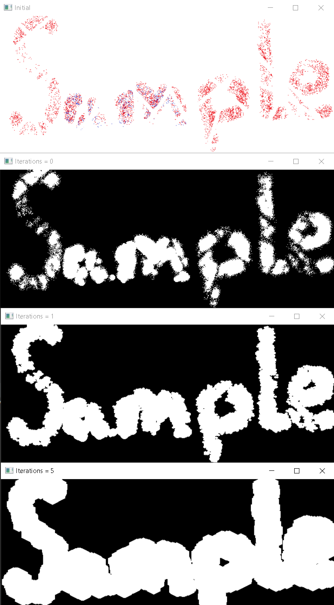

1.1. img_prep()
========
This function is used if you want to find contours in the image within a certain color range.

Usage
~~~~~

.. code-block:: python

    img_prep(img, low, high, iterations, blur_strength)

Parameters:
    * **img**: image to be processed. Must be a numpy array;
    * **low**: lower color range in HSV color space. Default is tuple (0, 0, 0). Must be a tuple of 3 integers;
    * **high**: upper color range in HSV color space. Default is tuple (255, 255, 255). Must be a tuple of 3 integers;
    * **iterations**: number of iterations for the morphological transformation. Default is 1. Must be an integer;
    * **blur_strength**: strength of the blur. Default is 0. Must be an integer.

Returns:
    * **dilated**: processed image
    * **contours**: list of contours found in the image
    * **hierarchy**: list of hierarchy found in the image

Examples
~~~~~~~~
If you input only picture, then it will completely satisfy the HSV range [0, 0, 0] - [255, 255, 255]:

.. code-block:: python

    transform.img_prep(frame)

----------------

By changing the range of the frame for the filter, you can choose which part of the image remains:

.. code-block:: python

    transform.img_prep(frame, (100, 0, 0), (255, 255, 255))
    transform.img_prep(frame, (0, 100, 100), (155, 255, 255))

----------------

By increasing the blur strength, you can achieve smoother borders and remove noise from the image:

.. code-block:: python

    transform.img_prep(frame, (1, 0, 0), (255, 255, 255), 0, 0)
    transform.img_prep(frame, (1, 0, 0), (255, 255, 255), 0, 10)

----------------

By increasing the number of iterations, you can close badly visible contours

.. code-block:: python

    transform.img_prep(frame, (1, 0, 0), (255, 255, 255), 0, 0)
    transform.img_prep(frame, (1, 0, 0), (255, 255, 255), 1, 0)
    transform.img_prep(frame, (1, 0, 0), (255, 255, 255), 5, 0)

----------------