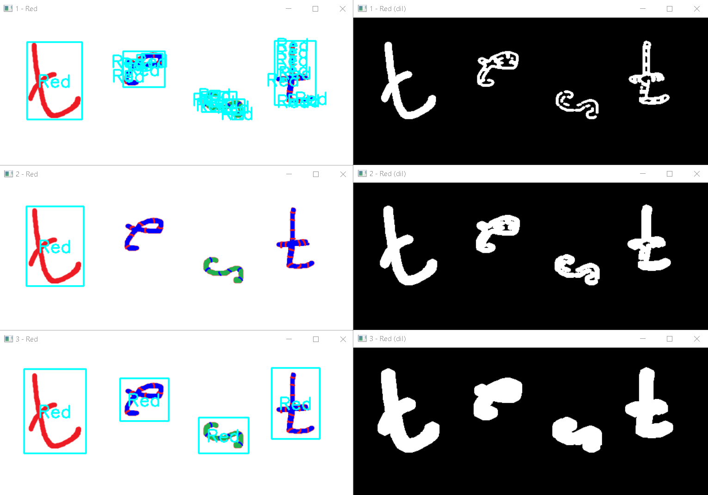

2.1. draw_rect_frame()
===============
This function is used if you want to find contours in the image within a certain color range and display a rectangular frame around them with the label

Usage
~~~~~

.. code-block:: python

    draw_rect_frame(img, low, high, label, iterations, blur_strength, min_area, only_max, text_color)

Parameters:
    * **img**: image to be processed. It must be a numpy array;
    * **low**: lower color range in HSV color space. Default is tuple (0, 0, 0). Must be a tuple of 3 integers;
    * **high**: upper color range in HSV color space. Default is tuple (255, 255, 255). Must be a tuple of 3 integers;
    * **label**: label to be displayed on the frame. Default is "". Must be a string;
    * **iterations**: number of iterations for the morphological transformation. Default is 1. Must be an integer;
    * **blur_strength**: strength of the blur. Default is 0. Must be an integer;
    * **min_area**: minimum area of the contour for detect. Default is 1000. Must be an integer;
    * **only_max**: if True, only the largest contour will be detected. Default is False. Must be a boolean;
    * **text_color**: color of the text in BGR. Default is (255, 0, 0). Must be a tuple of 3 integers.

Returns:
    * **img**: processed image
    * **dilated**: dilated image (for debug)

Examples
~~~~~~~~
For all examples, one image is used, which contains a completely red "t", a blue in red stripe "e" with a red outline, a green in blue stripe "s" with a red outline, and a blue in red stripe "t" with a red outline (How the parameters "low", "high", "iterations" and "blur_strength" affect you can read in paragraph 1.1. img_prep()):

----------------

By increasing the minimum area of the contours, some small contours can be removed:

.. code-block:: python

    figures.draw_rect_frame(img, (173, 82, 213), (180, 235, 255), "", 0, 0, 1000, False, (30, 255, 100))
    figures.draw_rect_frame(img2, (56, 194, 162), (80, 229, 229), "", 0, 0, 1000, False, (30, 255, 100))
    figures.draw_rect_frame(img3, (118, 194, 177), (175, 255, 255), "", 0, 0, 1000, False, (30, 255, 100))

.. code-block:: python

    figures.draw_rect_frame(img, (173, 82, 213), (180, 235, 255), "", 0, 0, 10, False, (30, 255, 100))
    figures.draw_rect_frame(img2, (56, 194, 162), (80, 229, 229), "", 0, 0, 10, False, (30, 255, 100))
    figures.draw_rect_frame(img3, (118, 194, 177), (175, 255, 255), "", 0, 0, 10, False, (30, 255, 100))

----------------

By setting the parameter "only_max" to True, only the largest contour will be detected. Set it to "True" for the last example and get:

.. code-block:: python

    figures.draw_rect_frame(img, (173, 82, 213), (180, 235, 255), "", 0, 0, 10, True, (30, 255, 100))
    figures.draw_rect_frame(img2, (56, 194, 162), (80, 229, 229), "", 0, 0, 10, True, (30, 255, 100))
    figures.draw_rect_frame(img3, (118, 194, 177), (175, 255, 255), "", 0, 0, 10, True, (30, 255, 100))

----------------

By setting the parameter "label" and "text_color", you can add a label to the frame and change color of the text and frame:

.. code-block:: python

    figures.draw_rect_frame(img, (173, 82, 213), (180, 235, 255), "Red", 0, 0, 10, True, (255, 255, 0))
    figures.draw_rect_frame(img2, (56, 194, 162), (80, 229, 229), "Green", 0, 0, 10, True, (255, 0, 255))
    figures.draw_rect_frame(img3, (118, 194, 177), (175, 255, 255), "Blue", 0, 0, 10, True, (0, 255, 255))

----------------

Example of complex settings for displaying thin contours:

.. code-block:: python

    figures.draw_rect_frame(img, (173, 82, 213), (180, 235, 255), "Red", 1, 0, 10, False, (255, 255, 0))
    figures.draw_rect_frame(img2, (173, 82, 213), (180, 235, 255), "Red", 2, 0, 100, True, (255, 255, 0))
    figures.draw_rect_frame(img3, (173, 82, 213), (180, 235, 255), "Red", 4, 0, 1000, False, (255, 255, 0))

----------------
