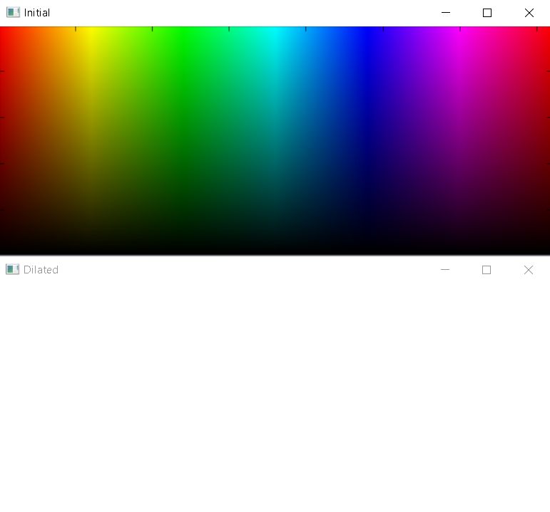
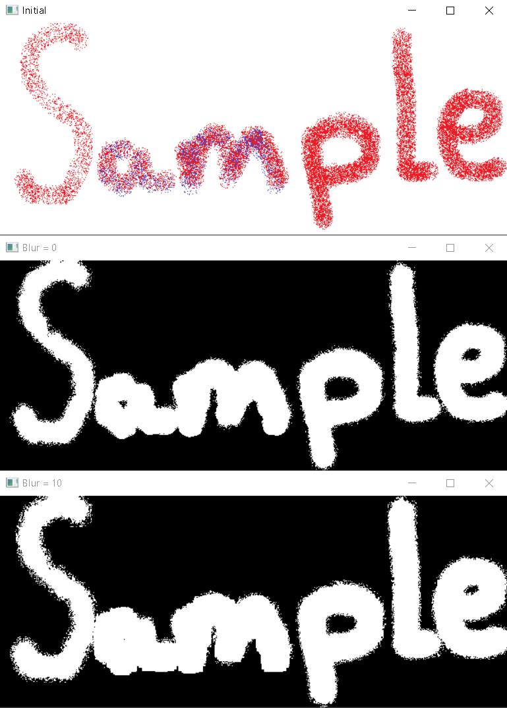

*********************
Modules and functions
*********************
This package contains several modules that contain functions sorted by operating principle. This is made for the convenience of using the package.

**Modules:**

#. transform
#. figures

1. transform
*********
This module contains functions that transform images.

1.1. img_prep()
========
This function is used if you want to find contours in the image within a certain color range.

Usage
~~~~~

.. code-block:: python

    img_prep(img, low, high, iterations, blur_strength)

Parameters:
    * **img**: image to be processed. It must be a numpy array;
    * **low**: lower color range in HSV color space. Default is tuple (0, 0, 0). Must be a tuple of 3 integers;
    * **high**: upper color range in HSV color space. Default is tuple (255, 255, 255). Must be a tuple of 3 integers;
    * **iterations**: number of iterations for the morphological transformation. Default is 1. Must be an integer;
    * **blur_strength**: strength of the blur. Default is 0. Must be an integer.

Returns:
    * **dilated**: processed image
    * **contours**: list of contours found in the image
    * **hierarchy**: list of hierarchy found in the image

Examples
~~~~~~~~
If you input only picture, then it will completely satisfy the HSV range [0, 0, 0] - [255, 255, 255]:

.. code-block:: python

    transform.img_prep(frame)

----------------

By changing the range of the frame for the filter, you can choose which part of the image remains:

.. code-block:: python

    transform.img_prep(frame, (100, 0, 0), (255, 255, 255))
    transform.img_prep(frame, (0, 100, 100), (155, 255, 255))

.. image:: ./Images/img_prep/2.png
    :width: 700px
    :align: center
    :alt: Part of the HSV range

----------------

By increasing the blur strength, you can achieve smoother borders and remove noise from the image:

.. code-block:: python

    transform.img_prep(frame, (1, 0, 0), (255, 255, 255), 0, 0)
    transform.img_prep(frame, (1, 0, 0), (255, 255, 255), 0, 10)

----------------

By increasing the number of iterations, you can close badly visible contours

.. code-block:: python

    transform.img_prep(frame, (1, 0, 0), (255, 255, 255), 0, 0)
    transform.img_prep(frame, (1, 0, 0), (255, 255, 255), 1, 0)
    transform.img_prep(frame, (1, 0, 0), (255, 255, 255), 5, 0)

.. image:: ./Images/img_prep/4.png
    :width: 700px
    :align: center
    :alt: Iterations

2. figures
*******
This module contains functions that create frame on the image.

2.1. draw_rect_frame()
===============
This function is used if you want to find contours in the image within a certain color range and display a rectangular frame around them with the label

Usage
~~~~~

.. code-block:: python

    draw_rect_frame(img, low, high, label, iterations, blur_strength, min_area, only_max, text_color)

Parameters:
    * **img**: image to be processed. It must be a numpy array;
    * **low**: lower color range in HSV color space. Default is tuple (0, 0, 0). Must be a tuple of 3 integers;
    * **high**: upper color range in HSV color space. Default is tuple (255, 255, 255). Must be a tuple of 3 integers;
    * **label**: label to be displayed on the frame. Default is "". Must be a string;
    * **iterations**: number of iterations for the morphological transformation. Default is 1. Must be an integer;
    * **blur_strength**: strength of the blur. Default is 0. Must be an integer;
    * **min_area**: minimum area of the contour for detect. Default is 1000. Must be an integer;
    * **only_max**: if True, only the largest contour will be detected. Default is False. Must be a boolean;
    * **text_color**: color of the text in BGR. Default is (255, 0, 0). Must be a tuple of 3 integers.

Returns:
    * **img**: processed image
    * **dilated**: dilated image (for debug)

Examples
~~~~~~~~
WIP

2.2. draw_ellipse_frame()
=================
This function is used if you want to find contours in the image within a certain color range and display the circumscribed ellipse with the label

Usage
~~~~~

.. code-block:: python

    draw_ellipse_frame(img, low, high, label, iterations, blur_strength, min_area, only_max, text_color)

Parameters:
    * **img**: image to be processed. It must be a numpy array;
    * **low**: lower color range in HSV color space. Default is tuple (0, 0, 0). Must be a tuple of 3 integers;
    * **high**: upper color range in HSV color space. Default is tuple (255, 255, 255). Must be a tuple of 3 integers;
    * **label**: label to be displayed on the frame. Default is "". Must be a string;
    * **iterations**: number of iterations for the morphological transformation. Default is 1. Must be an integer;
    * **blur_strength**: strength of the blur. Default is 0. Must be an integer;
    * **min_area**: minimum area of the contour for detect. Default is 1000. Must be an integer;
    * **only_max**: if True, only the largest contour will be detected. Default is False. Must be a boolean;
    * **text_color**: color of the text in BGR. Default is (255, 0, 0). Must be a tuple of 3 integers.

Returns:
    * **img**: processed image
    * **dilated**: dilated image (for debug)
    * **angle**: tilt angle of the ellipse if only_max is True. If only_max is False, returns None.

Examples
~~~~~~~~
WIP
